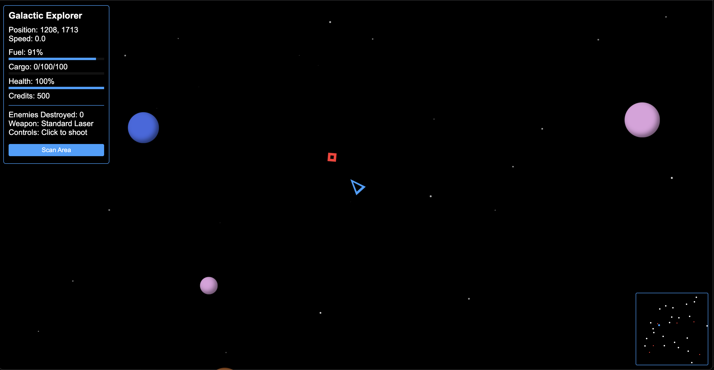
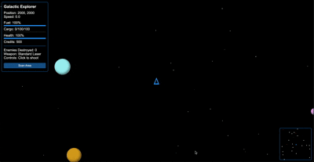
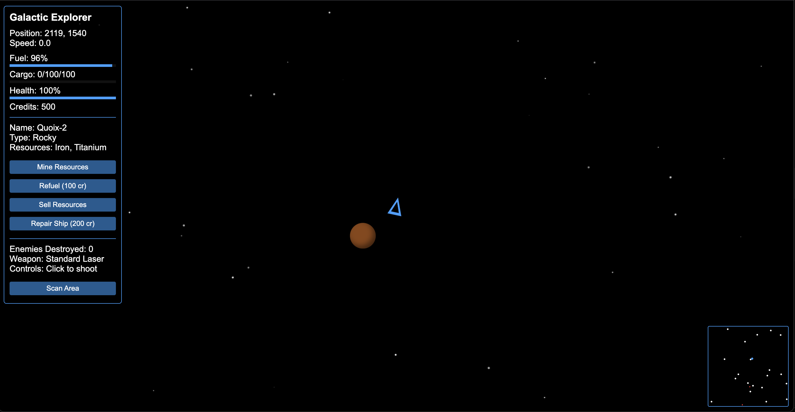

# Galactic Explorer 🚀

A thrilling space exploration and combat game built with HTML5, CSS, and JavaScript. Navigate through a vast galaxy, mine resources, trade with planets, and battle enemy ships!

## 🎮 Gameplay Features

- **Space Navigation**: Control your ship using WASD or arrow keys
- **Combat System**: Click to shoot lasers at enemy ships
- **Resource Mining**: Collect valuable resources from different types of planets
- **Trading System**: Sell resources for credits at various planets
- **Ship Management**: 
  - Refuel your ship
  - Repair damage
  - Manage cargo capacity
- **Dynamic Universe**: 
  - Procedurally generated starfield
  - Various planet types with unique resources
  - Enemy ships that chase and attack you
- **Minimap**: Navigate the vast space with the help of a minimap
- **UI Elements**: 
  - Resource bars
  - Health status
  - Fuel gauge
  - Cargo capacity
  - Credits display

## 🎯 Controls

- **Movement**: WASD or Arrow Keys
- **Shoot**: Click mouse
- **Brake**: Spacebar
- **Scan Area**: Click "Scan Area" button
- **Mine Resources**: Click "Mine Resources" button when near a planet
- **Refuel**: Click "Refuel" button when near a planet (costs 100 credits)
- **Repair**: Click "Repair Ship" button when near a planet (costs 200 credits)
- **Sell Resources**: Click "Sell Resources" button when near a planet

## 🌍 Planet Types

1. **Rocky Planets**
   - Resources: Iron, Titanium
   - Value: 50 credits per 10 units

2. **Ice Planets**
   - Resources: Water, Methane
   - Value: 40 credits per 10 units

3. **Lava Planets**
   - Resources: Platinum, Uranium
   - Value: 100 credits per 10 units

4. **Gas Giants**
   - Resources: Hydrogen, Helium
   - Value: 30 credits per 10 units

5. **Earth-like Planets**
   - Resources: Organics, Rare Metals
   - Value: 80 credits per 10 units

6. **Desert Planets**
   - Resources: Silicon, Rare Earths
   - Value: 60 credits per 10 units

## 🎥 Gameplay Video

## 🛠️ Technical Details

- Built with vanilla JavaScript
- Uses HTML5 Canvas for starfield rendering
- Responsive design that works on different screen sizes
- No external dependencies required

## 🚀 How to Play

1. Open `index.html` in a modern web browser
2. Use WASD or arrow keys to navigate your ship
3. Click to shoot at enemy ships
4. Visit planets to mine resources and trade
5. Manage your fuel, health, and cargo
6. Try to survive and accumulate as many credits as possible!

## 🎯 Tips

- Always keep an eye on your fuel level
- Use the minimap to navigate and avoid enemies
- Mine resources when your cargo hold is empty
- Repair your ship when health is low
- Use the scan feature to discover new planets
- Defeat enemies to earn extra credits

## 📸 Screenshots

## 🎮 Game Over Conditions

The game ends when your ship's health reaches 0. You can restart the game by clicking the "Play Again" button.

## 🔄 Future Updates

- [ ] Add different weapon types
- [ ] Implement ship upgrades
- [ ] Add more planet types
- [ ] Include space stations
- [ ] Add multiplayer support
- [ ] Implement achievements system

## 📝 License

This project is open source and available under the MIT License.

## 🤝 Contributing

Contributions are welcome! Please feel free to submit a Pull Request.

---

Made with ❤️ by Tarun Vishwakarma
